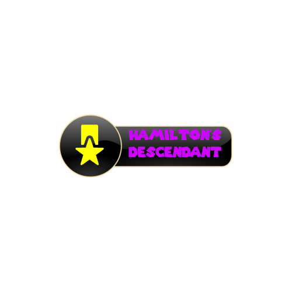
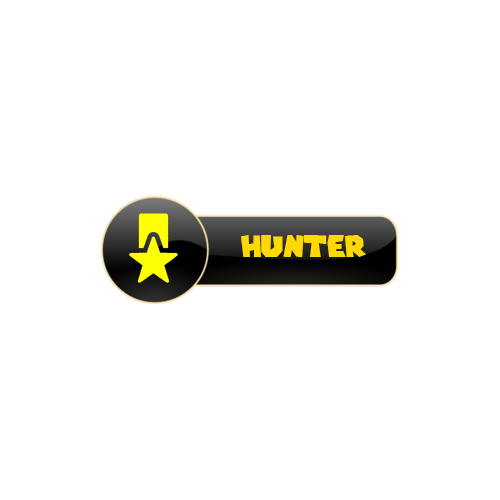
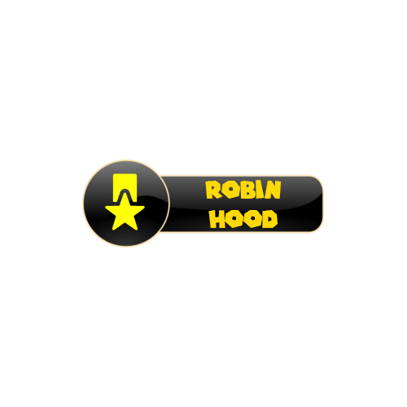

# HuntTheWumpus

## Achivements

 

Finish buy arrow mini-game in less than 7 seconds. 

 

Finish pit or hint mini-game in less than 7 seconds. 

 

Finish wumpus mini-game in less than 7 seconds. 

Score 500 point in the mini-game on the 1 lvl by drawing only 1 figure

Score 500 point in the mini-game on the 3 lvl by drawing only 1 

Enter all rooms of the cave

Go through all the rooms visiting each 1 time only

Explore 12 rooms

Get 2 arrows

Get 4 arrows

Get 8 arrows

## Documentaion

[Object assignment](https://github.com/hunt-the-wumpus/Docs).
